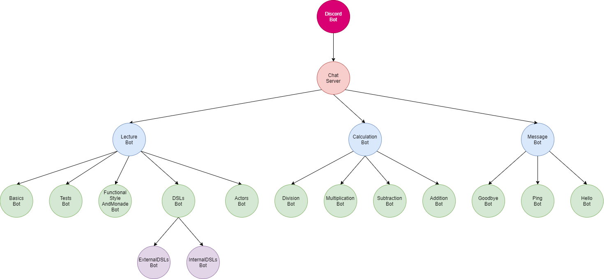

# ActorFamilyTree

## Description
The ActorFamilyTree project contains of different aspects of functional programming in Scala. The basic idea was to provide a Discord Chat Bot which can communicate within a private Discod server in the main channel. 
The Bot should be able to communicate with each user individually and answer to specific commands.

### Definition of Actors
The base functionality is defined as closed Actor System which uses each actor as specific node with unique functionality
The scope of function can be extracted from the Tree diagram shown below.

