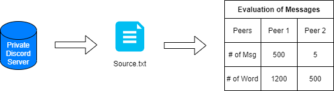

# ActorFamilyTree

## Description
The ActorFamilyTree project contains of different aspects of functional programming in Scala. The basic idea was to provide a Discord Chat Bot which can communicate within a private Discod server in the main channel. 
The Bot should be able to communicate with each user individually and answer to specific commands.

### Definition of Actors
The base functionality is defined as closed Actor System which uses each actor as specific node with unique functionality
The scope of function can be extracted from the Tree diagram shown below.

### Definition of Streams
To evaluate the Actor System and abd provide some sort of statistics Scala Streams are used. Therefore the Chat Bot was improved to be able to extract written messages from all time and provide them in the Resource/Source.txt. With this Dataset a specific evaluation according to the private Discord Server was enabled.

### Definition of Kafka
To implement event driven functionality to the ActorFamilyTree project, the Kafka API is used. The basic idea was to define the dataset of the stream application as producer for the Kafka architecture. Within this architecture, the data could be accessed by subscribing to a defined topic (_**messagedata**_).
The consumer on teh other side was able to evaluate each Message Type and provides a dynamic overall statistic for each message available.

### Definition of Spark
Spark paralizes the specific message calculations and acts like a Kafka Consumer within the architecture.

## Build information
 
